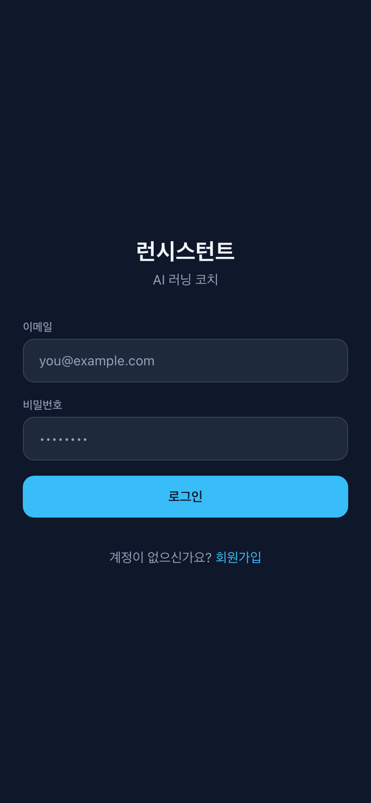
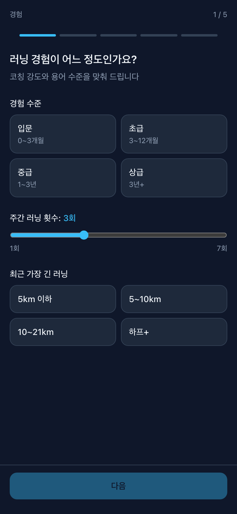
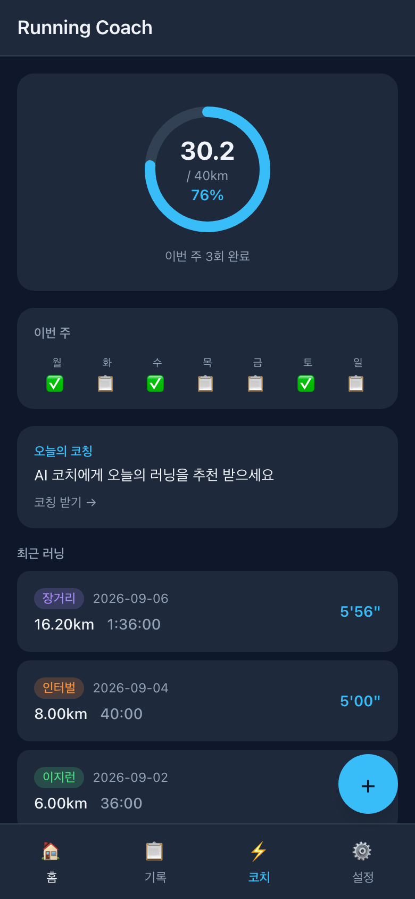
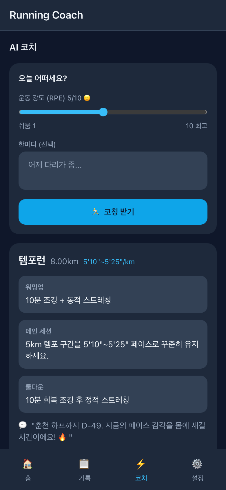
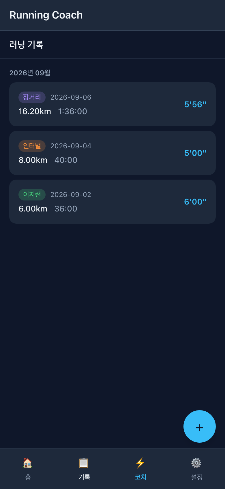
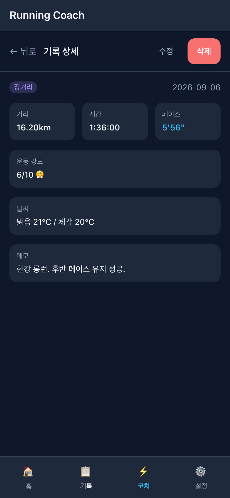
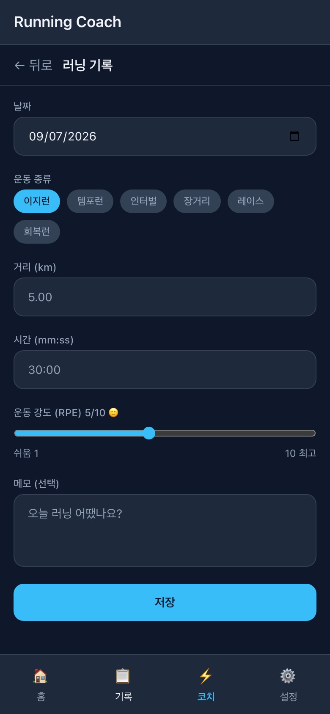
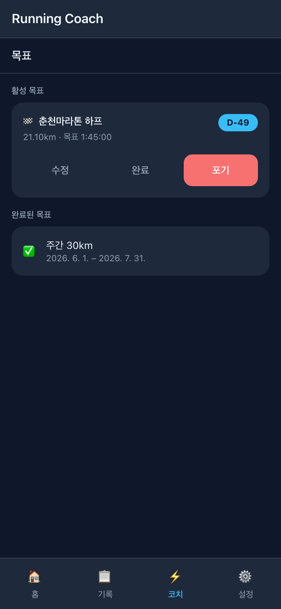

# 런시스턴트 (Runssistant)

러닝을 시작하는 건 쉽지만, 잘 뛰는 건 어렵습니다.
오늘 몇 km를 뛰어야 하는지, 이지런과 인터벌을 어떻게 섞어야 하는지, 대회 전에 훈련량을 얼마나 줄여야 하는지 — 혼자서 판단하기엔 막막한 것들이 많습니다.

런시스턴트(Runssistant)는 AI가 나의 체력, 컨디션, 목표를 분석해 오늘의 러닝을 추천하는 코칭 서비스입니다.
초보 러너부터 상급 러너까지, 기록하고 코칭받으며 체계적으로 성장할 수 있습니다.

AI 러닝 코치 앱의 **React 18 PWA 프론트엔드**입니다. 러너가 러닝 기록과 목표를
입력하면, AI 코치가 주간 볼륨·최근 러닝·날씨를 근거로 오늘의 세션을 추천합니다.
다크 테마 · 모바일 우선 · 오프라인 지원(PWA)으로, 야외에서 한 손으로 쓰도록 설계했습니다.

> 백엔드 API는 별도 저장소(`com.runssistant.api`)에 있습니다.

---

## 기술 스택

| 영역 | 선택 |
|------|------|
| 프레임워크 | React 18 + TypeScript + Vite |
| 라우팅 | React Router v7 |
| 클라이언트 상태 | Zustand (`authStore`, `uiStore`) |
| 서버 상태 | TanStack Query |
| 스타일 | Tailwind CSS 4 (다크 테마) |
| 폼 | React Hook Form + Zod |
| HTTP | `ky` (auth 인터셉터) |
| 차트 | Recharts |
| PWA / 오프라인 | vite-plugin-pwa (Workbox) · `idb` |

---

## 주요 기능

> 아래 스크린샷은 목킹 데이터로 캡쳐한 실제 화면입니다 (`docs/screenshots/`).

### 🔐 로그인 · 온보딩
로그인 후 최초 진입 시 5단계 온보딩 마법사로 러너 프로필(경험 수준, 주간 횟수,
선호 러닝 종류, 크로스 트레이닝, 부상 이력)을 수집합니다. 이 프로필은 AI 코칭의
개인화 근거가 됩니다.

| 로그인 | 온보딩 (경험 입력) |
|:---:|:---:|
|  |  |

### 🏠 홈 대시보드
주간 목표 진행률(링 차트), 이번 주 계획 캘린더, 최근 러닝, 볼륨·페이스 추이,
개인 기록을 한눈에 보여줍니다. 우측 하단 `+` 버튼으로 바로 러닝을 기록합니다.

### 🤖 AI 코치 *(핵심 기능)*
오늘의 컨디션(RPE)과 한마디를 입력하면 AI가 오늘의 세션(이지런/템포런/인터벌/
장거리/휴식)을 추천합니다. 워밍업·메인 세션·쿨다운, 추천 이유, 동기 부여 메시지까지
제공하며, "이 루틴으로 뛰기"로 러닝 기록 폼을 바로 채울 수 있습니다.

| 홈 대시보드 | AI 코치 추천 |
|:---:|:---:|
|  |  |

### 🏃 러닝 기록 · 상세
러닝 목록은 월별로 그룹화해 보여주고, 상세 화면에서 거리·시간·페이스·강도(RPE)·
날씨·메모를 확인하고 수정/삭제할 수 있습니다.

| 러닝 목록 | 러닝 상세 |
|:---:|:---:|
|  |  |

### ✍️ 러닝 입력 · 🎯 목표
날짜·종류·거리·시간·강도·메모로 러닝을 기록하고, 주간 볼륨 목표 또는 레이스 목표
(D-day 카운트다운 포함)를 설정·관리합니다.

| 러닝 입력 | 목표 관리 |
|:---:|:---:|
|  |  |

---

## 시작하기

```bash
npm install
npm run dev        # Vite 개발 서버 (HMR)
npm run build      # 프로덕션 빌드
npm run preview    # 빌드 결과 로컬 미리보기
npm run lint       # oxlint
```

개발 서버는 `/auth`, `/users`, `/runs`, `/stats`, `/goals`, `/plans`, `/coach`
요청을 `http://localhost:8000`(백엔드)으로 프록시합니다 (`vite.config.ts`).

---

## 아키텍처

```
api/ (ky 호출)  →  hooks/ (TanStack Query)  →  pages/  →  components/
```

- **`api/client.ts`** — 단일 `ky` 인스턴스. 모든 요청에 `Bearer` 토큰을 부착하고,
  401 시 인증 상태를 비우고 `/login`으로 이동합니다.
- **`stores/`** — Zustand는 JWT+사용자 정보(`authStore`, localStorage 영속)와
  UI 상태(`uiStore`, 토스트·온라인 여부)만 담당합니다.
- **오프라인** — 앱 셸은 서비스 워커로 캐시, API GET은 `NetworkFirst`(24h).
  POST 실패한 러닝은 IndexedDB 큐에 저장 후 온라인 복귀 시 재전송합니다.

### 라우트

```
/login, /signup   → 비인증
/                 → 홈 대시보드
/onboarding       → 온보딩 마법사
/runs · /runs/new · /runs/:id  → 러닝 목록/입력/상세
/goals            → 목표
/coach            → AI 코치 (핵심)
/settings · /settings/profile  → 설정 / 프로필 수정
```

---

## 스크린샷 재생성

```bash
npm run dev                          # 5173 실행 후
node scripts/capture-screenshots.mjs # docs/screenshots/*.png 갱신
```

`scripts/capture-screenshots.mjs`는 Playwright로 API 응답을 목킹하고 로그인 상태를
시드해 각 페이지를 모바일 뷰포트(390×844, 다크)로 캡쳐합니다. 백엔드가 없어도
동작합니다.
